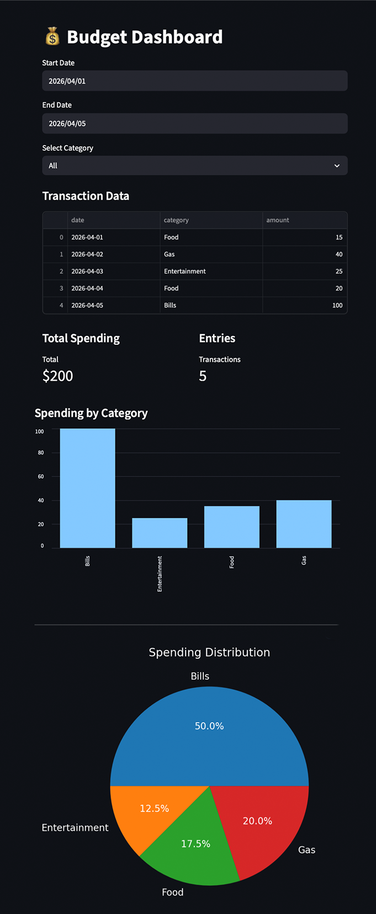

# 💰 Budget Dashboard

An interactive budget dashboard built with Python, Pandas, Streamlit, and Matplotlib.

## Features

* Filter transactions by date
* Filter transactions by category
* View total spending
* View number of transactions
* Bar chart for spending by category
* Pie chart for spending distribution

## Tech Stack

* Python
* Pandas
* Streamlit
* Matplotlib

## How to Run

Install dependencies:

bash
python3 -m pip install pandas streamlit matplotlib

Run the app:

bash
python3 -m streamlit run app.py

## Project Structure

budget-dashboard/
├── app.py
├── data.csv
├── README.md
└── .gitignore

## Preview

